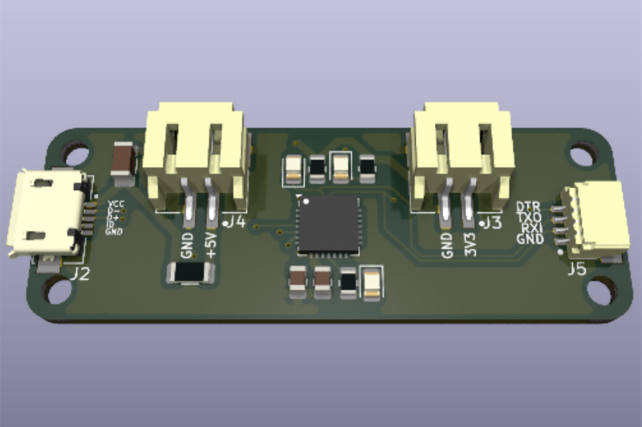
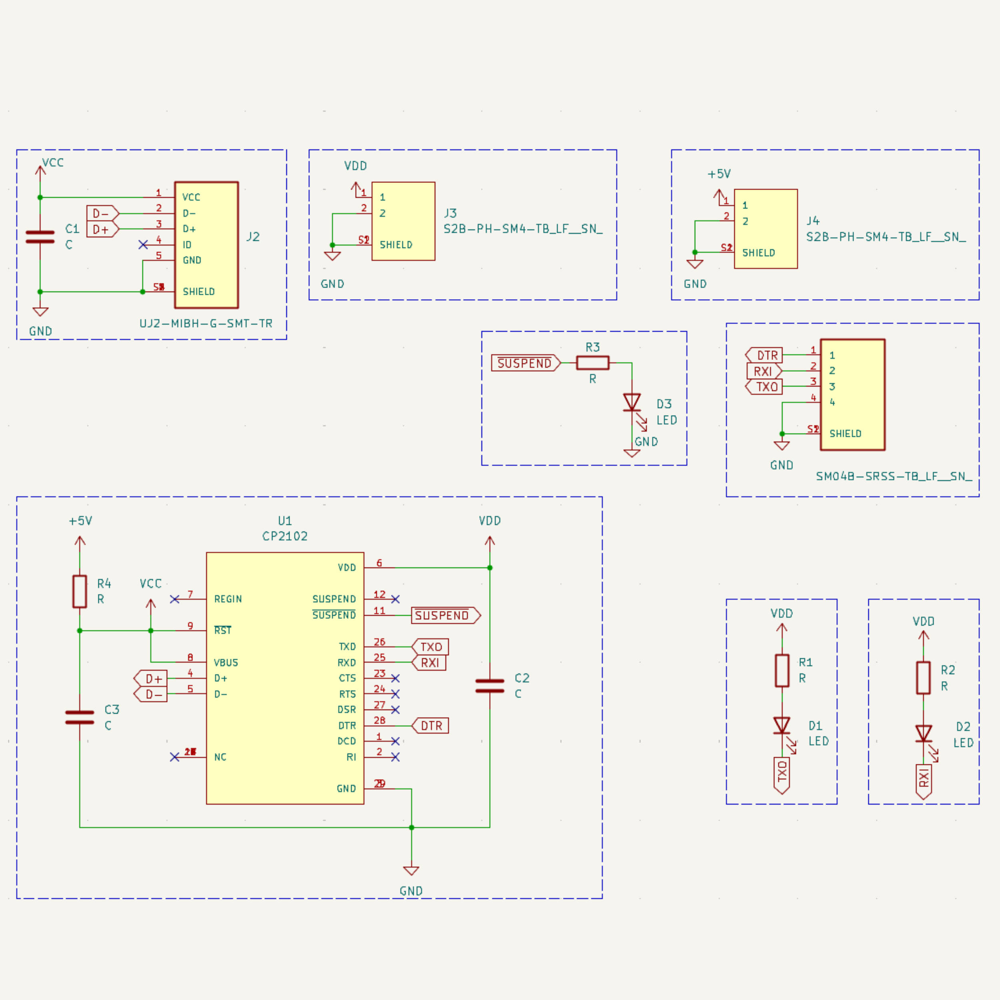
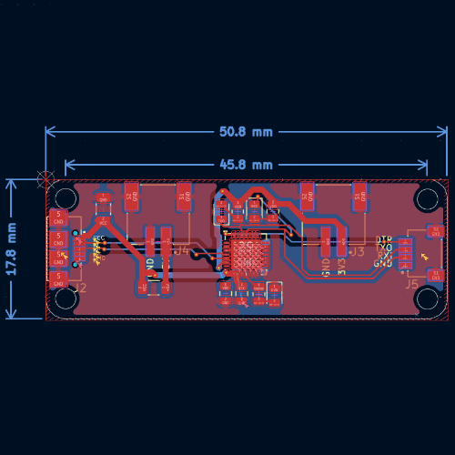
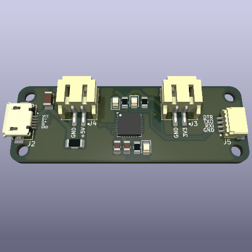

# UsbUartBridge

## 🚀 Overview

**UsbUartBridge** is an open-source PCB designed to provide a **USB-to-UART bridge** for seamless serial communication between a computer and microcontrollers. The board features **JST-SH & JST-PH connectors** for easy integration into embedded projects, IoT devices, and prototyping setups.

## 🎯 Purpose

- 🔌 **Reliable USB-to-Serial Conversion**: Enables communication between a PC and embedded systems via UART.
- 📏 **Compact and Adafruit-compatible**: Designed to fit within Adafruit's standard PCB footprint.
- 🛠️ **Open-source and customizable**: Modify and adapt the design to suit your specific needs.

## 📝 Features

| 🏷️ Feature            | 🔍 Description                                                                           |
| ---------------------- | ---------------------------------------------------------------------------------------- |
| 🔌 **USB Interface**   | Micro-USB (for PC connection)                                                            |
| 📡 **UART Interface**  | TX, RX, DTR                                                                              |
| 🔋 **Voltage Options** | 3.3V & 5V selectable output                                                              |
| 🛠️ **Connectivity**   | JST-SH & JST-PH connectors for easy integration                                          |
| 🔧 **Capacitors**      | Decoupling capacitors for stability                                                      |
| 🖥️ **PCB Design**     | Open-source & customizable                                                               |
| 🌍 **Use Cases**       | Debugging & Programming microcontrollers, IoT device communication, serial data transfer |

## 📐 PCB Design Preview
| 📜 Schematic | 🖥️ PCB Layout | 🏗️ 3D |
|-----------|-----------|-----------|
|  |  |  |

## 🌟 License

This project is open-source. Feel free to use, modify, and contribute! 🚀

